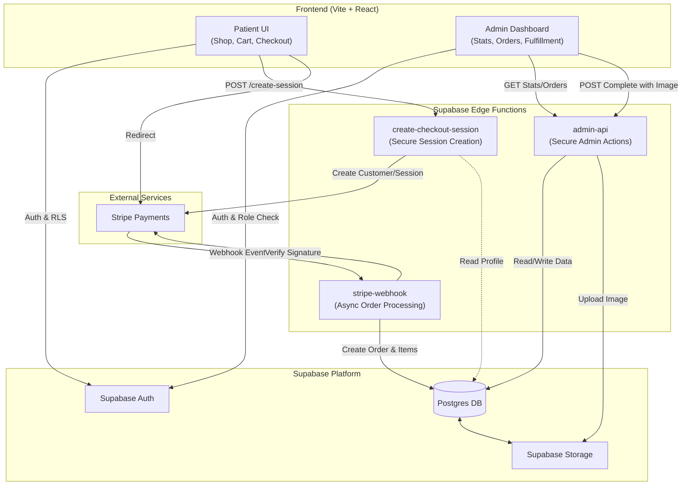

# Miremadi Dermatology & Web Store

A premium, high-performance web application for Dr. Arjang Miremadi, combining a dermatology service showcase with a full-featured e-commerce store. Built with modern web technologies to ensure speed, accessibility, and a stunning "Attio-style" aesthetic.

## ⚠️ Production Deployment Status

**Important Note:** While we have built a complete, enterprise-grade e-commerce system (including secure checkout, inventory management, and an admin fulfillment dashboard), the current production deployment is serving the **Static Informational Version** of the site. 

Per the customer's request and for legal/regulatory compliance, the e-commerce functionalities are implemented but remain deactivated in the live environment for the time being. The current production build focuses on providing patients with comprehensive practice information and service showcases.

## 🚀 Features

### Core Experience
- **Premium UI/UX**: Linear design system, glassmorphism, and micro-interactions powered by `framer-motion`.
- **Dark/Light Mode**: Fully supported dynamic theming.
- **PWA Support**: Installable on mobile devices with offline capabilities.
- **Responsive**: Mobile-first design that scales perfectly to desktop.

### E-Commerce (Shop) - *Ready for Activation*
- **Product Management**: Grid view with filtering and search.
- **Cart System**: High-performance cart state management using `zustand`.
- **Private Admin Dashboard**: Secure area for order management, fulfillment, and revenue tracking.
- **Wishlist**: Save favorite products (persisted locally).
- **Checkout Flow**: Secure Stripe-integrated checkout with server-side session creation.

### Content
- **Blog Engine**: A rich journal section for dermatology insights.
- **Service Showcase**: Animated presentation of medical and cosmetic services.

## 🛠 Tech Stack

- **Framework**: [Vite](https://vitejs.dev/) + [React](https://react.dev/)
- **Language**: [TypeScript](https://www.typescriptlang.org/)
- **Styling**: [TailwindCSS](https://tailwindcss.com/) (v4) + Custom Design System
- **State Management**: [Zustand](https://github.com/pmndrs/zustand)
- **Backend**: [Supabase](https://supabase.com/) (Auth, Database, Storage)
- **Edge Runtime**: [Deno](https://deno.com/) (Supabase Edge Functions)
- **Payments**: [Stripe](https://stripe.com/)
- **Animations**: [Framer Motion](https://www.framer.com/motion/)
- **PWA**: [Vite PWA](https://vite-pwa-org.netlify.app/)

## 🏗 System Architecture

High-level overview of the components and their interactions, including the secure e-commerce and admin fulfillment system.



## 🏃‍♂️ Getting Started

### Prerequisites
- Node.js (v18 or higher)
- npm or pnpm

### Installation

1. **Clone the repository**
   ```bash
   git clone <repo-url>
   cd Miremadi-Dermatology-Web
   ```

2. **Install dependencies**
   ```bash
   npm install
   ```

3. **Start Development Server**
   ```bash
   npm run dev
   ```
   Visit `http://localhost:5173` to view the app.

4. **Build for Production**
   ```bash
   npm run build
   ```

## 📍 Project Status & Roadmap

The application has reached **Phase 3 Completion**. The core frontend, backend secure payments, and admin fulfillment loop are implemented.

### ✅ Completed
- [x] **Frontend Architecture**: Complete React+Vite app with Attio-style design system.
- [x] **Product Store & Cart**: Functional shopping cart with local persistence.
- [x] **Admin Dashboard**: Secure backend-driven dashboard for order management.
- [x] **Backend Logic**: Cloud Edge Functions for `checkout`, `webhooks`, and `admin-api`.
- [x] **Security**: Row Level Security (RLS) and Role-Based Access Control (RBAC).

### 🚧 In Progress / Next Steps
- [ ] **Live Deployment**: Deploy frontend to Vercel/Netlify.
- [ ] **Stripe Production**: Switch Stripe keys from Test to Live mode.
- [ ] **Domain Setup**: configure custom domain and SSL.
- [ ] **Content Population**: Replace placeholder product images with real inventory photos.

For detailed documentation, see the [`DOCS/`](./DOCS/) directory.
